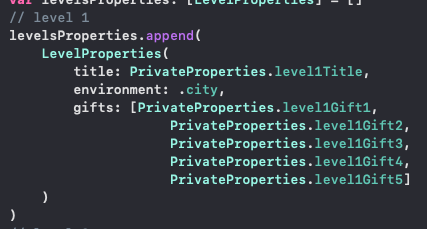
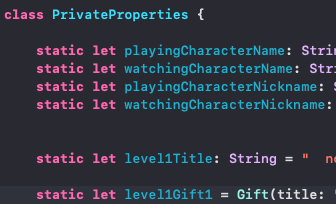

*Bienvenue sur la page GitHub du jeu notre histoire - Welcome on the notre histoire game GitHub page.*

Pour lire la version française 🇫🇷 du fichier README, veuillez cliquez [ici](#version-française).

To read the english version 🇬🇧 of the README file, please click [here](#english-version)

# 🇫🇷
### version française

# Table des matières

[1. Ma demande en mariage : principe du jeu](#1-ma-demande-en-mariage)
* [1a. Principe du jeu](#1a-principe)
* [1b. Côté technique](#1b-côté-technique)

[2. La méthode à suivre pour personnaliser le jeu](#2-la-personnalisation)
* [2a. Personnaliser les graphismes](#2a-personnaliser-les-graphismes)
* [2b. Personnaliser les niveaux](#2b-personnaliser-les-niveaux)
* [2c. Personnaliser les éléments privés](#2c-personnaliser-les-éléments-privés)

[3. Les consignes de jeu](#3-le-gameplay)
* [3a. Présenter le jeu à l'élu(e) de votre coeur](#3a-présenter-le-jeu)
* [3b. Jouer](#3b-jouer)
* [3c. Débloquer le niveau 11](3c-débloquer-le-niveau-11)

# 1 Ma demande en mariage

## Sommaire

[1a. Principe du jeu](#1a-principe)

[1b. Côté technique](#1b-côté-technique)

## 1a Principe

Cette application est celle qui compte le plus pour moi car m'a permis de *demander ma femme en mariage*. Il s'agit par ailleurs du premier jeu vidéo que j'ai developpé, au tout début de ma formation et en parallèle de celle-ci.

Il s'agit d'un jeu de plateformes (type Super Mario). Le jeu est divisé en 11 niveaux, dont 10 niveaux de jeu et le dernier permettant de faire la demande.

Chacun des 10 premiers niveaux représente une période de la vie de couple.
Dans chacun de ces niveaux, le but du personnage principal (représentant l'heureuse élue) est de retrouver 5 objets cachés (représentant chacun un souvenir particulier de la période concernée par le niveau). Ces 5 objets, une fois collectés, permettent d'ouvrir la cage dans laquelle est enfermé l'autre personnage (la personne faisant sa demande).

Le onzième niveau représente la demande en mariage, et ne doit être joué que lorsque le créateur du jeu est prêt à faire sa demande. En effet, une fois les 10 premiers niveaux terminés, un message d'alerte va s'afficher à l'écran d'accueil du jeu pour indiquer le fait qu'un bug (faux) est survenu.
Si le créateur du jeu n'est pas prêt encore à faire sa demande, il peut temporiser en disant qu'il jettera un oeil au code pour corriger le bug.
Lorsqu'il est prêt à faire sa demande, il lui suffira d'appuyer sur le coeur qui se déplace sur l'écran d'accueil jusqu'à ce qu'il devienne blanc. Lorsque le coeur est blanc, cela signifie que le niveau 11 peut être joué.

Dans le niveau 11, le personnage principal doit avancer jusqu'à ce qu'il tombe nez à nez avec le personnage de la personne qui va faire sa demande. Ce personnage annonce alors que ce niveau se joue à deux, et que le créateur du jeu va lui expliquer (dans la vraie vie, en dehors du jeu) comment se joue ce niveau. La personne fait alors une petite introduction à sa demande. Une fois l'introduction terminée, l'heureuse élue peut alors appuyer sur l'écran, et l'écran affiche alors qu'il s'agit de la demande en mariage. Il ne reste plus alors qu'à plier genou et espérer une réponse positive...

## 1b Côté technique

Le jeu a été effectué grâce à *SpriteKit* et *GameplayKit*. Comme indiqué, il a été créé alors que je venais de commencer ma formation, il faudrait donc que je l'améliore grâce à mes connaissances acquises depuis, que je nettoie le code pour le rendre plus lisible, mais il fonctionne très bien en l'état.

# 2 La personnalisation

## Sommaire

[2a Personnaliser les graphismes](#2a-personnaliser-les-graphismes)

[2b Personnaliser les niveaux](#2b-personnaliser-les-niveaux)

[2c Personnaliser les éléments privés](#2c-personnaliser-les-éléments-privés)

## 2a Personnaliser les graphismes

Plusieurs graphismes peuvent être personnalisés, mais cela n'est pas pour autant obligatoire.
Il est cependant conseillé de [personnaliser les personnages](#2a1-personnaliser-le-graphisme-des-personnages), mais [personnaliser les lieux](#2a2-personnaliser-le-graphisme-des-lieux) [et les monstres](#2a3-personnaliser-le-graphisme-des-monstres) est également possible.

De manière générale, pour personnaliser les graphismes, il suffit de modifier l'image correspondante dans les assets en gardant les mêmes dimensions et le même nom de fichier.

Voici néanmoins quelques précisions

### 2a1 Personnaliser le graphisme des personnages

Deux personnages peuvent être personnalisés : le héros et la personne à délivrer.

Le héros est représenté par les images commençant par *character*, la personne à délivrer par *character2*.

Chacun possède plusieurs images les représentant en train de marcher ou immobiles.

### 2a2 Personnaliser le graphisme des lieux

Il existe 5 lieux possibles, appelés Environment dans le code : *beach, castle, city, forest, garden*.

Chacun de ces lieux a plusieurs images, représenant le fond du niveau, les blocs de mur, les blocs au sol, etc.

### 2a3 Personnaliser le graphisme des monstres

Les monstres n'ont en soi aucun graphisme, il s'agit d'emojis. Les deux seuls utilisés sont modifiables dans le fichier *MonsterSprite.swift*.

## 2b Personnaliser les niveaux

Les niveaux peuvent être personnalisés en en modifiant le titre, l'environnement et les souvenirs qui y sont liés.

Le titre et les souvenirs sont des éléments privés, donc se reporter à la partie qui suit.

Pour l'environnemment, il suffit d'aller dans l'init de la class *CustomizableProperties* (dans le fichier du même nom) et de personnaliser l'environnement de chaque niveau en indiquant *.beach, .castle, .city, .forest,* ou *.garden*.

## 2c Personnaliser les éléments privés

Pour tout ce qui est privé, il convient de créer un fichier *PrivateProperties.swift*.

Ce fichier va contenir une classe PrivateProperties. Cette classe ne comportera que des variables statiques qui contiendront :
- le prénom des personnages via deux variables de type *String* : *playingCharacterName* pour le personnage qui joue, et *watchingCharacterName* pour le personnage qui est enfermé ;
- le surnom des personnages via deux variables de type *String* : *playingCharacterNickname* pour le personnage qui joue, et *watchingCharacterNickname* pour le personnage qui est enfermé ;
- les informations relatives aux niveaux qui comportent des éléments privés. Il s'agira du titre du niveau ainsi que les souvenirs qui y seront attachés. Pour chaque niveau, il conviendra de créer une variable statique de type *String* appelée *levelXTitle* comportant le titre du niveau, et 5 variables de type *Gift* correspondant aux souvenirs et et intitulées *levelXGift1* à *levelXGift5* (où X correspond au numéro de niveau, donc de 1 à 10). Pour chaque *Gift* il conviendra de préciser le titre du souvenir, le message à faire apparaître, et une image qui est de type String et qui dans la version initiale du jeu correspondait à un émoticone.

# 3 Le gameplay

## Sommaire

[3a. Avant toute chose](#3a-avant-toute-chose)

[3b. Présenter le jeu à l'élu(e) de votre coeur](#3b-présenter-le-jeu)

[3c. Jouer](#3c-jouer)

[3d. Débloquer le niveau 11](3d-débloquer-le-niveau-11)

## 3a Avant toute chose

Vous êtes pressé de faire votre demande, mais avant de présenter le jeu à votre bien-aimé(e), il convient d'effectuer quelques vérifications.

### 3a1 Gérer les musiques

#### 3a1a Choisir les musiques ...

Chaque niveau comporte une musique. 
Au premier lancement du jeu, il vous sera demandé de choisir les musiques que vous voulez pour chaque niveau.
ATTENTION : une fois toutes les musiques choisies, vous ne pourrez plus les modifier à moins de désinstaller le jeu et de le réinstaller.

Le jeu utilise Apple Music. 
Le simulateur ne fonctionne pas avec la fonction musique de l'application.

#### 3a1b ... ou désactiver les musiques

Si vous ne souhaitez pas choisir et donc utiliser de la musique dans le jeu, ou si vous souhaitez lancer l'application sur le simulateur pour le tester, il convient de désactiver le choix des musiques dans l'application. 

Pour cela, rendez-vous sur le fichier *HomeViewController.swift* :
- pour activer le choix des musiques : la ligne 49 doit être désactivée, la ligne 50 doit être activée ;
- pour désactiver le choix des musiques : la ligne 49 doit être activée, la ligne 50 doit être désactivée.

Dans l'image ci-dessus, le choix des musiques est activé.

### 3a2 Tester le jeu

Part importante du travail. Si vous voulez que tout soit parfait, vérifiez bien que le jeu fonctionne sur votre appareil, et surtout que les éléments que vous avez personnalisé apparaissent correctement à l'écran.

## 3b Présenter le jeu

La présentation du jeu à votre bien-aimé(e) est libre. Il ne faut pas faire de gaffe, ne pas évoquer la demande en mariage évidemment, et dire qu'il s'agit d'un petit cadeau plein d'amour que vous lui avez fait, un souvenir du temps passé ensemble.

## 3c Jouer

Une fois sur l'écran principal, le bouton Jouer permet de lancer la partie. Lors du premier niveau, le fonctionnement est expliqué au joueur. Lorsqu'un message s'affiche, il suffit d'appuyer sur l'écran pour passer au suivant.

Lorsque les 10 premiers niveaux sont terminés, le fait d'appuyer sur le bouton Jouer ne suffira pas à lancer le niveau 11. En effet, le niveau 11 est celui de la demande en mariage. Donc un faux bug s'affichera à l'écran et vous devez faire la personne étonnée et dire que vous allez vous penchez sur le code pour corriger ça. Evidemment, il n'y a rien à corriger, vous pourrez débloquer le niveau 11 lorsque vous serez prêt(e) à faire votre demande.

## 3d Débloquer le niveau 11

### 3d1 Quand

Le niveau 11 est celui de la demande en mariage, donc deux éléments doivent être réunis pour pouvoir le débloquer :
- votre bien-aimé(e) doit avoir terminé les 10 premiers niveaux ;
- vous devez être prêt(e) pour effectuer la demande (avoir la bague, être au bon endroit, au bon moment, ...)

### 3d2 Comment

Tout d'abord vérifiez que cous avez bien la bague à proximité. Ensuite préparez votre appareil, lancez le jeu sans que cela ne se remarque, et appuyez sur le coeur qui se balade sur l'écran d'accueil jusqu'à ce qu'il devienne blanc. Lorsque le coeur est blanc, cela signifie que le jeu est prêt à démarrer le niveau 11.
Lorsque votre appareil est prêt, et surtout que vous êtes prêt(e) à effectuer votre demande, dites à votre bien-aimé(e) que vous avez réussi à réparer le bug, et que le niveau 11 peut être joué (en espérant que la personne en face acceptera...)

Pour le niveau 11, le personnage de votre bien-aimé(e) sera avancé jusqu'à rencontrer votre personnage, et alors un dialogue commencera.
Le dialogue, le voici :

Votre bien-aimé(e): "Euh... c'est tout ?"

Vous: "Bah non, le niveau ne fait que commencer !"

Votre bien-aimé(e): "Ok... Mais du coup je n'ai pas à te sortir d'une cage dans ce niveau ?"

Vous: "En effet. Ce niveau se joue à deux."

Vous: "Pour la suite, c'est au vrai (Votre nom) de t'expliquer comment se joue ce niveau. Quand il te le dira, appuie sur l'écran pour lancer le niveau. Mais seulement quand il te le dira !"

Et là c'est à vous... Vous devez donc faire une petite introduction à votre demande. Quand c'est terminé, dites-lui d'appuyer sur l'écran.
La musique que vous avez choisie pour la demande se lance (si vous en avez choisi une) et quelques secondes après s'affiche alors sur l'écran qu'il s'agit de la demande en mariage.
Il ne vous reste plus qu'à sortir la bague, plier genou, et poser la fameuse question.

# 🇬🇧

### english version

*in progress...*

