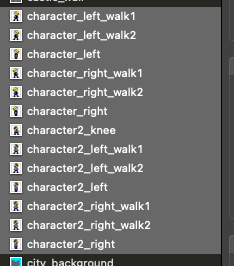

*Bienvenue sur la page GitHub du jeu notre histoire - Welcome on the notre histoire game GitHub page.*

Pour lire la version française 🇫🇷 du fichier README, veuillez cliquez [ici](#🇫🇷).

To read the english version 🇬🇧 of the README file, please click [here](#🇬🇧)

# 🇫🇷

# Table des matières

[1. Ma demande en mariage : principe du jeu](#1-ma-demande-en-mariage)
* [1a. Principe du jeu](#1a-principe)
* [1b. Côté technique](#1b-côté-technique)

[2. La méthode à suivre pour personnaliser le jeu](#2-la-personnalisation)
* [2a. Personnaliser les graphismes](#2a-personnaliser-les-graphismes)
* [2b. Personnaliser les niveaux](#2b-personnaliser-les-niveaux)
* [2c. Personnaliser les éléments privés](#2c-personnaliser-les-éléments-privés)

[3. Les consignes de jeu](#3-le-gameplay)
* [3a. Présenter le jeu à l'élu(e) de votre coeur](#3a-présenter-le-jeu)
* [3b. Jouer](#3b-jouer)
* [3c. Débloquer le niveau 11](3c-débloquer-le-niveau-11)

# 1 Ma demande en mariage

## Sommaire

[1a. Principe du jeu](#1a-principe)

[1b. Côté technique](#1b-côté-technique)

## 1a Principe

Cette application est celle qui compte le plus pour moi car m'a permis de *demander ma femme en mariage*. Il s'agit par ailleurs du premier jeu vidéo que j'ai developpé, au tout début de ma formation et en parallèle de celle-ci.

Il s'agit d'un jeu de plateformes (type Super Mario). Le jeu est divisé en 11 niveaux, dont 10 niveaux de jeu et le dernier permettant de faire la demande.

Chacun des 10 premiers niveaux représente une période de la vie de couple.
Dans chacun de ces niveaux, le but du personnage principal (représentant l'heureuse élue) est de retrouver 5 objets cachés (représentant chacun un souvenir particulier de la période concernée par le niveau). Ces 5 objets, une fois collectés, permettent d'ouvrir la cage dans laquelle est enfermé l'autre personnage (la personne faisant sa demande).

Le onzième niveau représente la demande en mariage, et ne doit être joué que lorsque le créateur du jeu est prêt à faire sa demande. En effet, une fois les 10 premiers niveaux terminés, un message d'alerte va s'afficher à l'écran d'accueil du jeu pour indiquer le fait qu'un bug (faux) est survenu.
Si le créateur du jeu n'est pas prêt encore à faire sa demande, il peut temporiser en disant qu'il jettera un oeil au code pour corriger le bug.
Lorsqu'il est prêt à faire sa demande, il lui suffira d'appuyer sur le coeur qui se déplace sur l'écran d'accueil jusqu'à ce qu'il devienne blanc. Lorsque le coeur est blanc, cela signifie que le niveau 11 peut être joué.

Dans le niveau 11, le personnage principal doit avancer jusqu'à ce qu'il tombe nez à nez avec le personnage de la personne qui va faire sa demande. Ce personnage annonce alors que ce niveau se joue à deux, et que le créateur du jeu va lui expliquer (dans la vraie vie, en dehors du jeu) comment se joue ce niveau. La personne fait alors une petite introduction à sa demande. Une fois l'introduction terminée, l'heureuse élue peut alors appuyer sur l'écran, et l'écran affiche alors qu'il s'agit de la demande en mariage. Il ne reste plus alors qu'à plier genou et espérer une réponse positive...

## 1b Côté technique

Le jeu a été effectué grâce à *SpriteKit* et *GameplayKit*. Comme indiqué, il a été créé alors que je venais de commencer ma formation, il faudrait donc que je l'améliore grâce à mes connaissances acquises depuis, que je nettoie le code pour le rendre plus lisible, mais il fonctionne très bien en l'état.

# 2 La personnalisation

## Sommaire

[2a Personnaliser les graphismes](#2a-personnaliser-les-graphismes)

[2b Personnaliser les niveaux](#2b-personnaliser-les-niveaux)

[2c Personnaliser les éléments privés](#2c-personnaliser-les-éléments-privés)

## 2a Personnaliser les graphismes

Plusieurs graphismes peuvent être personnalisés, mais cela n'est pas pour autant obligatoire.
Il est cependant conseillé de [personnaliser les personnages](#2a1-personnaliser-le-graphisme-des-personnages), mais [personnaliser les lieux](#2a2-personnaliser-le-graphisme-des-lieux) [et les monstres](#2a3-personnaliser-le-graphisme-des-monstres) est également possible.

De manière générale, pour personnaliser les graphismes, il suffit de modifier l'image correspondante dans les assets en gardant les mêmes dimensions et le même nom de fichier.

Voici néanmoins quelques précisions

### 2a1 Personnaliser le graphisme des personnages

Deux personnages peuvent être personnalisés : le héros et la personne à délivrer.

Le héros est représenté par les images commençant par "character", la personne à délivrer par "character2".

Chacun possède plusieurs images les représentant en train de marcher ou immobiles.

### 2a2 Personnaliser le graphisme des lieux

Il existe 5 lieux possibles, appelés Environment dans le code : beach, castle, city, forest, garden.

Chacun de ces lieux a plusieurs images, représenant le fond du niveau, les blocs de mur, les blocs au sol, etc.

### 2a3 Personnaliser le graphisme des monstres

Les monstres n'ont en soi aucun graphisme, il s'agit d'emojis. Les deux seuls utilisés sont modifiables dans le fichier MonsterSprite.swift.

## 2b Personnaliser les niveaux

Les niveaux peuvent être personnalisés en en modifiant le titre, l'environnement et les souvenirs qui y sont liés.

Le titre et les souvenirs sont des éléments privés, donc se reporter à la partie qui suit.

Pour l'environnemment, il suffit d'aller dans l'init de la class CustomizableProperties (dans le fichier du même nom) et de personnaliser l'environnement de chaque niveau en indiquant .beach, .castle, .city, .forest, ou .garden.

## 2c Personnaliser les éléments privés

Pour tout ce qui est privé, il convient de créer un fichier PrivateProperties.swift.

Ce fichier va contenir une classe PrivateProperties. Cette classe ne comportera que des variables statiques qui contiendront :

*en cours de rédaction...*

# 3 Le gameplay

## Sommaire

[3a. Présenter le jeu à l'élu(e) de votre coeur](#3a-présenter-le-jeu)

[3b. Jouer](#3b-jouer)

[3c. Débloquer le niveau 11](3c-débloquer-le-niveau-11)

## 3a Présenter le jeu

*en cours de rédaction...*

## 3b Jouer

*en cours de rédaction...*

## 3c Débloquer le niveau 11

### 3c1 Quand

*en cours de rédaction...*

### 3c2 Comment

*en cours de rédaction...*

# 🇬🇧

*in progress...*

